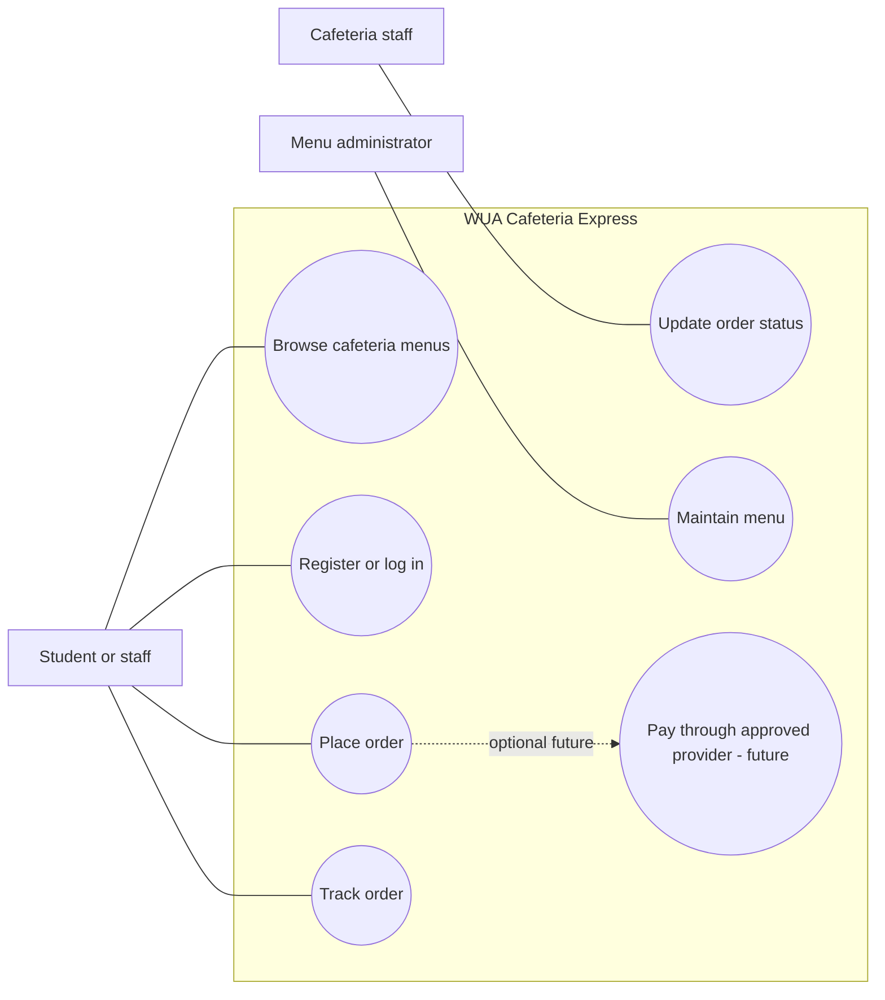

# UML Use Case Diagram

```mermaid
flowchart LR
  Student[Student or staff]
  Staff[Cafeteria staff]
  Admin[Menu administrator]
  subgraph System[WUA Cafeteria Express]
    UC1((Browse cafeteria menus))
    UC2((Register or log in))
    UC3((Place order))
    UC4((Track order))
    UC5((Update order status))
    UC6((Maintain menu))
    UC7((Pay through approved provider - future))
  end
  Student --- UC1
  Student --- UC2
  Student --- UC3
  Student --- UC4
  UC3 -. optional future .-> UC7
  Staff --- UC5
  Admin --- UC6
```

Selected detailed descriptions are in `requirements.md`.